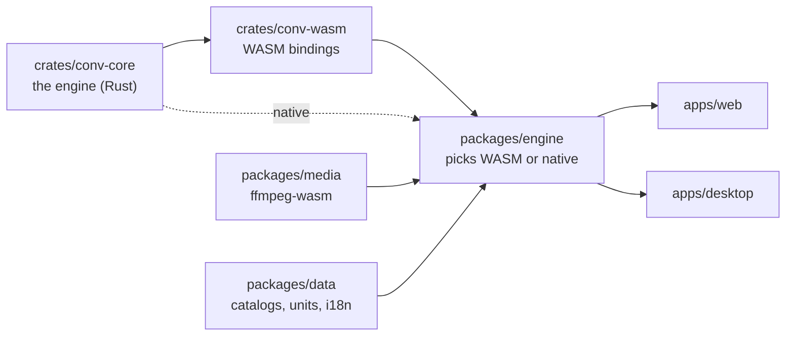

# conv.cat

**File conversion, purr-fected.** Convert images, video, audio, text/data, units, timezones and
CAD files — entirely on your device. Nothing you convert is ever uploaded anywhere, and this
repository is how you know that's true, not just a claim on a marketing page.

[](https://github.com/tachsin/conv.cat/actions/workflows/licence-boundary.yml)
[](#licence)

## Your files never leave your device — here's the source

Every conversion runs client-side: a Rust engine compiled to WebAssembly in the browser, or
running natively in the desktop app. There is no upload step, because there is no server that
conversions pass through. That's not a promise you have to take on faith — it's what the code in
`crates/conv-core` and `packages/engine` in this repository actually does, and you're welcome to
read it, build it yourself, or point network-inspector tools at the running app while you convert
a file and watch nothing go out. Open source is what makes "we don't see your files" a checkable
fact instead of a line in a privacy policy.

## Demo

A recording goes here once `apps/web` has a working UI — tracked as
[Phase 2](docs/ROADMAP.md#phase-2--web-mvp) of the roadmap. This repository is a from-scratch
rebuild in progress (see [Status](#status-of-this-repository) below); in the meantime, the
quickstart below gets you a local build to try yourself.

## How is this different from VERT.sh?

[VERT.sh](https://vert.sh) is the closest thing to this project already out there, and it's a
good reference point, not a rival to dunk on: open source, entirely client-side, same "your files
never leave your device" premise. If you already like VERT, you'll recognize the shape of what
we're building. Three things we're doing differently:

- **Breadth.** Not just media and documents — images, video, audio, text/data, units,
  timezones, and CAD, all through the same engine and the same UI, including the genuinely niche
  stuff (clothing sizes, cooking measurements, cat/dog years) that a narrower tool wouldn't
  bother with.
- **Six-locale i18n as a first-class citizen.** English, German, Greek, Spanish, French, and
  Turkish, with translation designed from the start to be a community contribution — not
  something bolted on after launch (see the [roadmap](docs/ROADMAP.md#phase-3--full-format-parity--i18n)).
- **One shared Rust core, two runtimes.** `crates/conv-core` compiles to WebAssembly for the web
  app *and* links natively into the desktop app — one implementation, not two that have to be
  kept in sync by hand. See [ARCHITECTURE.md](docs/ARCHITECTURE.md).

If this project reads like "VERT but bigger," that's a fair read of the ambition. The bet is that
breadth, translation, and one engine across web and desktop are worth the extra scope.

## Supported formats

**Nothing converts yet — this is a ground-up rebuild in progress.** The table below is the
target catalog, not what's shipped today; see [Status](#status-of-this-repository) and the
[roadmap](docs/ROADMAP.md#format-catalog--target-state) for the real, current state.

| Category | Target formats | Status |
| --- | --- | --- |
| Units | Length, mass, temperature, volume, clothing sizes, cooking measurements, cat/dog years, and more | 📋 Planned |
| Images | PNG, JPEG, WebP, AVIF, BMP, GIF, ICO, QOI, HEIC (decode) | 📋 Planned |
| Video & Audio | Whatever [ffmpeg-wasm](https://ffmpegwasm.netlify.app/) supports, via `packages/media` | 📋 Planned |
| Text & Data | CSV, JSON, HTML, Markdown | 📋 Planned |
| Timezones | IANA zones, interactive world map | 📋 Planned |
| CAD | STL, STEP, OBJ | 📋 Planned |

## Quickstart

Toolchains are pinned via `.nvmrc` and `rust-toolchain.toml` — `nvm`/`rustup` pick up the right
versions automatically.

```bash
# JS side — one install bootstraps every package in apps/* and packages/*
pnpm install
pnpm build

# Rust side — one build covers every crate in crates/*
cargo build
cargo test
```

There is no `pnpm dev` yet — `apps/web` doesn't have a UI to serve until
[Phase 2](docs/ROADMAP.md#phase-2--web-mvp) lands (see [Status](#status-of-this-repository)).
This section will be updated with a one-command local dev server the moment that's true; until
then, `pnpm build`/`cargo test` is how you verify your checkout works.

## Architecture

One Rust engine, compiled two ways: to WebAssembly for the browser, and linked natively into the
desktop app. `apps/*` never contain conversion logic — they're UI over `packages/engine`, which
picks the right backend at runtime.



Full write-up, including why video/audio deliberately stays on ffmpeg-wasm instead of being
ported to Rust, and the dependency rule CI enforces: [`docs/ARCHITECTURE.md`](docs/ARCHITECTURE.md).

## Layout

```
conv.cat/
├─ apps/
│  ├─ web/          Next.js app            (AGPL-3.0-only)
│  └─ desktop/      Tauri app              (AGPL-3.0-only)
├─ crates/
│  ├─ conv-core/    Rust engine            (MIT)
│  └─ conv-wasm/    wasm-bindgen bindings  (MIT)
├─ packages/
│  ├─ engine/       TS wrapper: WASM in browser, native in Tauri (MIT)
│  ├─ media/        ffmpeg-wasm, stays TS  (MIT)
│  └─ data/         catalogs, units, timezones, i18n (MIT)
├─ docs/            community & architecture docs
└─ .github/         CI workflows, issue/PR templates
```

Every member has its own `README.md` — read it before touching that code; each one states
what the package is and what it must never contain (the ground rule is: **conversion logic
lives in `crates/conv-core`, nowhere else** — not in the apps, not in `packages/data`).

## Status of this repository

This is a public, from-scratch rebuild — it does not run the live conv.cat product yet. The
monorepo scaffold, the split licence, and the licence-boundary CI check are done; the conversion
engine itself (the `Converter` trait, the format registry, every actual converter) has not been
built. See [`docs/ROADMAP.md`](docs/ROADMAP.md) for the honest, staged plan — what's shipped, what's
scoped, and what's still just direction. If you're used to the live site's current feature set,
none of it should be assumed present here yet.

## Contributing

Contributions welcome, including AI-assisted ones — see
[`docs/ai-contributions.md`](docs/ai-contributions.md) for the ground rules (you're accountable
for what you submit, and you must have actually run it).

- [`docs/CONTRIBUTING.md`](docs/CONTRIBUTING.md) — setup, monorepo tour, commit conventions, tests, PR expectations.
- [`docs/adding-a-format.md`](docs/adding-a-format.md) — the complete worked example for adding one conversion end to end. **Format work means writing Rust** — read this before starting.
- [`docs/CODE_OF_CONDUCT.md`](docs/CODE_OF_CONDUCT.md) — Contributor Covenant 2.1.
- [`docs/SECURITY.md`](docs/SECURITY.md) — private vulnerability disclosure.

Not a Rust person? Translation, format catalog data, docs, and test fixtures are all real
contributions that don't touch `crates/conv-core` — see the end of
[`docs/adding-a-format.md`](docs/adding-a-format.md#if-you-dont-write-rust).

## Licence

conv.cat uses a split licence, matching the layout above:

- **MIT** — `crates/conv-core`, `crates/conv-wasm`, `packages/engine`, `packages/media`,
  `packages/data`. Reuse the conversion engine and libraries in your own software, including
  closed-source and commercial software.
- **AGPL-3.0-only** — `apps/web`, `apps/desktop`. Run a modified version of the apps as a
  network service and you must publish the corresponding source of your modifications.

Each of those directories has its own `LICENSE` file with the authoritative terms; the root
[`LICENSE`](LICENSE) maps which licence applies where.

Dependency direction matters here: `apps/*` may import the MIT packages and crates, but no
crate or package may ever depend on `apps/*` — that would pull AGPL code into the MIT half.
See [`docs/ARCHITECTURE.md`](docs/ARCHITECTURE.md).

## Trademark

The licences cover the code, not the brand. The name **"conv.cat"**, the **conv.cat domain**,
and the **conv.cat logo and mascot** are not granted by either licence and remain the property
of the project owner.

You are free to fork, modify and redistribute the code under the terms above, but a fork must
not present itself as conv.cat: pick your own name, your own domain and your own logo, and do
not imply that your build is the official one or endorsed by it. Referring to conv.cat
factually — "based on conv.cat", "a fork of conv.cat" — is fine.
