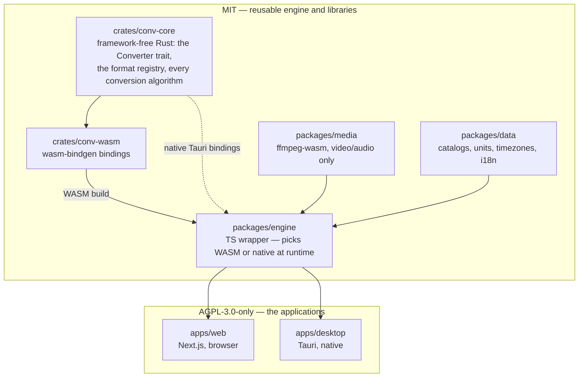
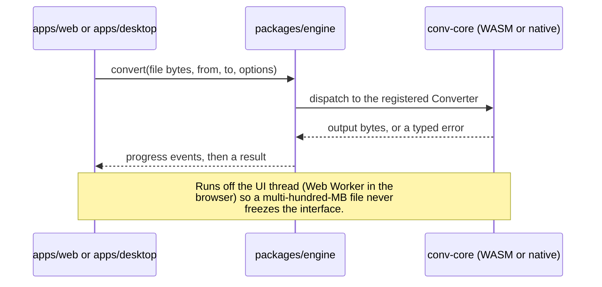

# Architecture

## Status

This describes the target architecture for the OSS rebuild, some of which is still being built
(see [ROADMAP.md](ROADMAP.md)). The live conv.cat product today runs on a separate, pre-OSS
codebase, not this repository — the production-cutover plan that governs when this repo takes
over is tracked in the backlog and will land as its own doc once decided. Treat file paths below
as the layout contributors build into, not necessarily as things that already exist on disk;
each package's own README states whether it is still a scaffold.

## One engine, two runtimes

conv.cat's premise is that the exact same conversion code runs in the browser and on the
desktop — not two implementations that are supposed to agree, but one implementation compiled
two ways:



`crates/conv-core` owns every conversion algorithm and knows nothing about its host: no
wasm-bindgen types, no DOM, no assumptions about a JS event loop (see its README). It compiles
and tests as a plain native Rust crate. Two things sit on top of it, and only two:

- **`crates/conv-wasm`** — a thin wasm-bindgen translation layer, compiled to WASM and consumed
  in the browser. This is the only crate in the workspace allowed to reference wasm-bindgen,
  `web-sys`, or `js-sys`.
- **Native bindings inside `apps/desktop`** — the same `conv-core` crate, linked directly into
  the Tauri app. No WASM round-trip, no browser sandbox, no bundle-size budget.

`packages/engine` is the seam between them: one TypeScript interface, implemented once against
the WASM build and once against the native Tauri commands. `apps/web` and `apps/desktop` both
import `@conv.cat/engine` and neither one knows, or needs to know, which backend it is actually
talking to.

### Why one engine

The alternative — a browser implementation and a separate native implementation — is how
projects quietly ship two conversion engines that drift apart: a unit rounds differently, a
format decodes one edge case correctly in one build and not the other, and nobody notices until
a user reports it against whichever platform they happen to be on. A single Rust core makes
"does this format convert correctly" a question with one answer, checked once by the
[conformance suite](#the-conformance-suite), that both apps inherit for free. It also means a
future CLI or a future integration only has to bind `conv-core` again, not reimplement it.

### The conversion request lifecycle



`conv-core` exposes one dispatch entry point, `convert(input, from, to, options)`, that resolves
the right `Converter` implementation from a `Format` registry (id, category, MIME type,
extensions, whether it can be read/written) or returns a typed "unsupported pair" error — never
a panic. Panics are treated as a security bug in this crate: these converters parse untrusted
binary files, and a panic reachable from user input is a denial-of-service at best. See
[`docs/adding-a-format.md`](adding-a-format.md) for the trait shape and a worked example, and
[SECURITY.md](SECURITY.md) for how malformed-input crashes are reported.

### Typed errors and identifiers, not human strings

`conv-core` returns typed errors and typed format/unit identifiers, not English sentences. The
UI layer (`apps/web`, `apps/desktop`, via `packages/data`'s i18n bundles) is what turns
`Error::UnsupportedPair { from, to }` or a unit id into a localized string. If the Rust core
returned prose, that prose would be permanently unlocalizable — every one of the six planned
locales would either bake in English or duplicate the mapping. Getting this boundary right in
`conv-core` from the start is why it is called out here rather than left as a detail contributors
discover later.

## The media boundary: video and audio stay on ffmpeg-wasm

Every other category in this repo — units, images, text/data, CAD — is real conversion logic
that belongs in `crates/conv-core`, ported to Rust so the same code runs natively on desktop.
Video and audio are the deliberate exception, and `packages/media` stays TypeScript, calling
[ffmpeg-wasm](https://ffmpegwasm.netlify.app/), by design:

- ffmpeg is already a mature, battle-tested engine covering an enormous matrix of codecs and
  containers. Re-implementing even a useful subset of that in Rust, inside `conv-core`, would be
  a multi-year effort for a project of this size, for no real correctness or performance gain
  over calling the existing compiled-to-WASM build.
- ffmpeg-wasm already ships a native desktop story of its own (ffmpeg itself, statically linked)
  that `apps/desktop` can call directly when it needs the non-WASM path — the "compile once, run
  everywhere" argument that justifies porting the rest of the catalog to Rust does not apply here
  the same way, because ffmpeg is already the everywhere-portable implementation.
- **Wrapping ffmpeg in Rust — shelling out to a bundled binary, or binding `libavcodec` via FFI —
  is explicitly out of scope for this project.** If you're evaluating a contribution that adds a
  Rust ffmpeg wrapper to `crates/conv-core`, stop: it will not be accepted. Route media features
  through `packages/media` instead.

`packages/media` is exposed to `apps/web` / `apps/desktop` through the same `@conv.cat/engine`
interface as the Rust-backed converters, so UI call sites never need to know which category is
native Rust and which is ffmpeg-wasm underneath. It must never contain non-media conversion logic
(units, images, text, CAD, …) — those belong in `crates/conv-core`.

One practical constraint that follows from this choice: threaded ffmpeg-wasm needs
cross-origin-isolation headers (COEP/COOP) from the host page. `apps/web` has to ship those
headers, and that requirement has previously conflicted with third-party embeds on the legacy
site — worth checking before adding an embed or a script tag to `apps/web`. The same headers
would also be needed if `crates/conv-wasm` ever grows real WASM threads or `SharedArrayBuffer`-based
cross-thread cancellation — neither exists yet (today's WASM build is single-threaded; see
`packages/engine/README.md` "Cross-origin isolation (COEP/COOP)" for the exact trigger condition)
— but when one of them does, it's worth solving the header/embed conflict once for both
`packages/media` and `packages/engine`, not twice.

## Dependency direction

The repository is licensed in two halves (see [`../LICENSE`](../LICENSE)):

| Half | Directories | Licence |
| --- | --- | --- |
| Libraries | `crates/conv-core`, `crates/conv-wasm`, `packages/engine`, `packages/media`, `packages/data` | MIT |
| Applications | `apps/web`, `apps/desktop` | AGPL-3.0-only |

**Dependencies flow one way only: apps depend on libraries, never the reverse.**

- ✅ `apps/web` importing `@conv.cat/engine`, `@conv.cat/media`, `@conv.cat/data`.
- ✅ `apps/desktop` depending on `conv-core` / `conv-wasm`.
- ✅ `crates/conv-wasm` depending on `crates/conv-core`; `packages/engine` depending on the
  crates' WASM output.
- ❌ **Any** crate or package depending on `apps/*` — a path dependency, a workspace import, a
  relative `../../apps/...` import, a type imported from an app, or a test fixture reached into
  from `apps/`.

### Why this is not just tidiness

The MIT half exists so third parties can embed the conversion engine in their own software,
including closed-source software. The moment a library imports anything from `apps/*`, it is
a derivative work of AGPL code, and the MIT grant on that library becomes a promise the project
cannot keep. A contributor who adds one convenience import breaks the licence guarantee for
every downstream user — silently, because the code still compiles.

### If you need something that lives in an app

Move it down, do not reach up. Shared logic belongs in the layer that both sides can depend on:

- conversion logic → `crates/conv-core` (framework-free, browser-free — see its README);
- catalogs, units, static data → `packages/data`;
- browser/native engine glue → `packages/engine`.

If it genuinely cannot move down, it is app-specific and should be duplicated per app rather
than shared upward.

### Enforcement

This rule is checked in CI by [`.github/workflows/licence-boundary.yml`](../.github/workflows/licence-boundary.yml),
which runs [`.github/scripts/check-licence-boundary.sh`](../.github/scripts/check-licence-boundary.sh)
on every push to `main` and every pull request. It catches Rust path dependencies, app packages
listed in a library's `package.json`, imports crossing the boundary by package name or relative
path, and files under `crates/`/`packages/` pointing at an app directory. Markdown is exempt:
a README saying "consumed by `apps/web`" describes the correct direction and is not a dependency.

Run it locally before pushing — it needs no toolchain and takes under a second:

```bash
./.github/scripts/check-licence-boundary.sh
```

## The conformance suite

Because `conv-core` is a from-scratch rewrite of conversion behaviour, and because the whole
point of this repo is to accept format contributions from people who are not the original
author, correctness is enforced by a golden-file conformance suite living in
`crates/conv-core/tests/`, not by review alone:

- Small, licence-clean input fixtures per format, committed to the repo.
- Byte-exact expected output for deterministic encoders (PNG, BMP, QOI, lossless text); structural
  assertions (dimensions, valid header, decodes cleanly, size within a tolerance band) for lossy
  paths where byte-exact output is not meaningful (JPEG, WebP).
- A deliberately-corrupt-input corpus: every malformed file must produce a typed error, never a
  panic or a hang. This doubles as the security regression suite referenced in
  [SECURITY.md](SECURITY.md).

The harness itself lives in `crates/conv-core/tests/support/mod.rs`: golden-file comparison (with
a one-command `UPDATE_GOLDENS=1` regeneration path), and a watchdog-thread guard around each
malformed-input case that catches a panic and enforces a timeout, so a misbehaving converter can
only ever fail its own test, never crash the suite or hang CI. That guard is proven independently
of any real converter, using test-double `Converter`s, in
`crates/conv-core/tests/golden_harness_selftest.rs` — the harness has to be trustworthy before a
stranger's converter PR leans on it. `.github/workflows/conv-core-tests.yml` runs the whole suite
on every push and PR, so a conformance regression fails CI, not just a local `cargo test`.

See [`docs/adding-a-format.md`](adding-a-format.md) for how a new format's golden files fit into
this, and [CONTRIBUTING.md](CONTRIBUTING.md) for the rule on regenerating goldens.
